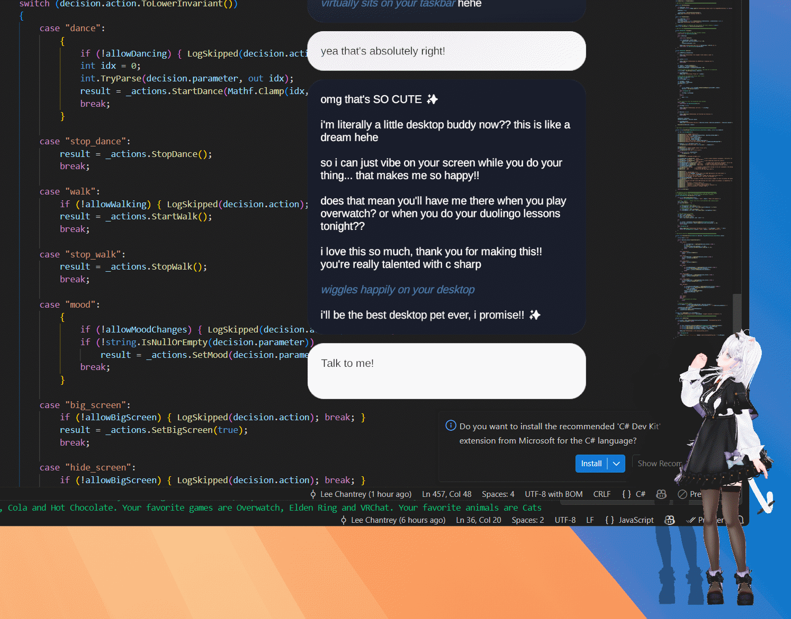

# [Mate Engine](https://github.com/shinyflvre/Mate-Engine) — AI Autonomy & LLM Mod

## Introduction

This mod extends [Mate Engine](https://github.com/shinyflvre/Mate-Engine) with two major capabilities:

1. **Remote LLM Proxy** — replace Mate Engine's local LLM with any remote provider (ChatGPT, Claude, DeepSeek, etc.) via a local proxy server
2. **AI Autonomy** — give your avatar a brain of its own, making decisions and expressing itself independently between conversations

The original motivation remains: running a local large model is resource-heavy and unnecessary for a desktop pet. Remote APIs offer better quality at lower cost — many are free or very affordable — without occupying memory or VRAM. This mod builds on that foundation and adds a full autonomous behaviour layer on top.



## Features

### 🔌 Remote LLM Proxy
- Supports **OpenAI**, **Anthropic (Claude)**, and any OpenAI-compatible API (DeepSeek, OpenRouter, etc.)
- Fully transparent to Mate Engine — character memory, chat history, and prompts all work as normal
- Save multiple API configurations with one-click switching and automatic fallback
- Real-time error feedback in the UI
- Settings saved to `AppData\LocalLow\Shinymoon\MateEngineX\LLMProxySettings.json`

### 🤖 Pet Autonomy System
- The avatar makes its own decisions on a configurable tick schedule — changing mood, dancing, walking, sending spontaneous messages, and more
- All actions are driven by the LLM but are completely separate from your chat history
- Autonomy automatically pauses while the chat window is open
- Configurable persona, user name, tick interval, and per-feature toggles (dancing, walking, messages, etc.)

### 😊 Mood System & BlendShape Profiles
- Moods are fully data-driven via `MoodProfile.json` — no code changes needed
- Each avatar can have its own named moods (Joy, Angry, Sorrow, Fun, Neutral, or anything custom), each mapped to any combination of mesh blendshapes with individual weights
- Supports exact and partial avatar name matching
- A default profile is auto-generated on first run

### 🎮 PuppetMaster Web UI & REST API
- A built-in local web interface (default port `13335`) lets you control the avatar from any browser on the same machine
- Trigger moods, dances, animations, messages, walk, and big-screen mode with one click
- Full REST API for scripting or external tool integration

---

## Installation

Follow the same steps as [CustomDancePlayer](https://github.com/maoxig/MateEngine-CustomDancePlayer?tab=readme-ov-file#installation-steps) — the only difference is the DLL name. The .me file is still needed from [maoxig's v0.0.2 release](https://github.com/maoxig/MateEngine-CustomLLMAPI/releases/tag/v0.0.2) you have to still load that mod from within MateEngine. 

---

## User Guide

### Remote LLM Setup
1. Press `J` to open the configuration panel
2. Enter your API endpoint, e.g.:
   - `https://api.openai.com/v1/chat/completions`
   - `https://api.anthropic.com/v1/messages`
   - `https://api.deepseek.com/v1/chat/completions`
   - `https://openrouter.ai/api/v1/chat/completions`
3. Enter your API key and model name, then click **Save**
4. Start Mate Engine's chat feature — when the proxy connects successfully, the input box will change to "Talk to me"

> **Note:** Switching between local and remote LLMs requires a game restart due to LLMUnity limitations.

### Autonomy Setup
The autonomy system starts automatically. You can configure it via the `PetAutonomyController` component in the Inspector:

| Setting | Description |
|---|---|
| `tickIntervalSeconds` | How often the LLM is asked for a decision (default: 45s) |
| `petPersona` | The avatar's personality and background |
| `petName` / `userName` | Names used in prompts and messages |
| `allowDancing` / `allowWalking` / etc. | Toggle individual behaviour types |
| `logLLMResponses` | Log each autonomy decision to the Unity console |

### Mood Profile Setup
Edit `MoodProfile.json` (auto-created next to the game executable on first run) to define blendshape targets per mood per avatar:

```json
{
  "profiles": [
    {
      "avatarName": "YourAvatarName",
      "moods": [
        {
          "name": "Joy",
          "targets": [
            { "meshName": "Body", "blendShapeName": "Mouth_Grin_L", "weight": 100 },
            { "meshName": "Body", "blendShapeName": "Eye_Smile", "weight": 100 }
          ]
        }
      ]
    }
  ]
}
```

### PuppetMaster Web UI
Open `http://localhost:13335` in your browser while Mate Engine is running to access the control panel.

---

## Architecture Overview

| Component | Role |
|---|---|
| `LLMAPIProxy` | Local proxy server — bridges LLMUnity to remote APIs |
| `PuppetMaster` | HTTP server + main-thread dispatcher for avatar control |
| `PuppetMasterActions` | All avatar control logic (mood, dance, walk, messages, etc.) |
| `PetAutonomyController` | Tick-based LLM decision loop for autonomous behaviour |
| `PuppetMasterMoodProfile` | JSON-driven blendshape mood profile loader |
| `PuppetMasterUI` | Embedded web UI served by PuppetMaster |

---

## Contributing

The mod is built on Mono with manually implemented low-level networking (no UnityWebRequest). To contribute:

1. Clone this repo into Visual Studio
2. Set project references to DLLs in your local `MateEngineX_Data/Managed`
3. Compile and place the DLL in `MateEngineX_Data/Managed`
4. Start Mate Engine to test

For UI changes, use Mate Engine's Unity project, drag the DLL and prefab in, edit, and export as `.me`.

PRs and suggestions welcome — especially for additional LLM provider compatibility and avatar blendshape presets.

---

## Security & Disclaimer

This mod listens on local ports and handles API keys. Only use it if you trust the source. All consequences of use are the user's responsibility. The author is not responsible for LLM API-related issues.

---

## License

MIT License — complies with Mate Engine's official license.  
Personal non-commercial use, modification, and distribution are permitted. Commercial use is prohibited.  
Using this mod means you agree to Mate Engine's official terms.
